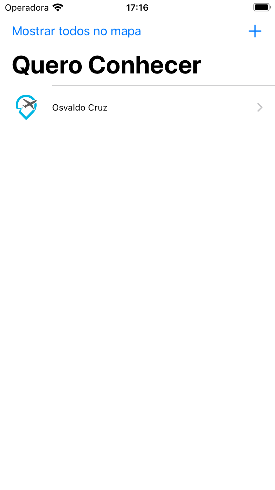
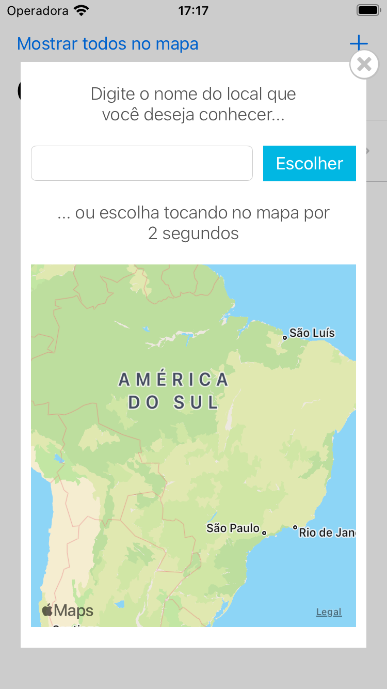
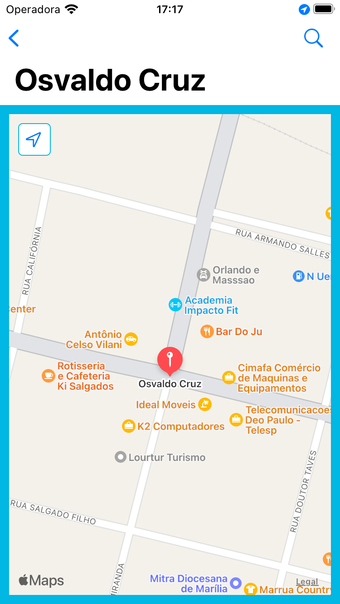

# QueroConhecer
> Aplicativo para desenvolvimento Swift/iOS

## Conceitos abordados

* Linguagem
    * Swift 5.5
    * MVC

* Auto Layout
    * Constraint
    * Assets

* Components
    * UIView
    * UILabel
    * UINavigation
    * UITableView
    * UIButton
    * UIText
    * UIButton
    * Activity Indicator
    * SearchBar
    * AlertController
    * Extension Equatable
        * Para dizer a linguagem Swift como verificar se um objeto é igual ao outro
    * Enum
    * Gesture recognizers
    * Propriedades computadas
    * UserDefaults para persistência de dados
    * MapKit
    * MKAnnotation
    * ColorSet
    * Segue

## Snapshots

 

 

